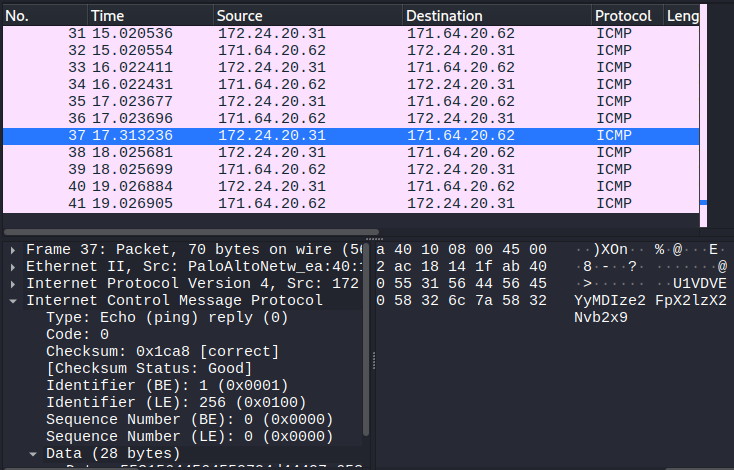
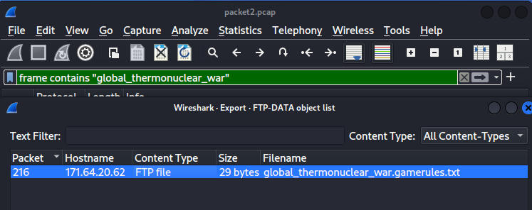
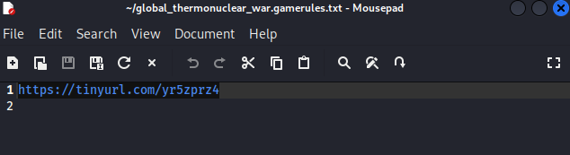
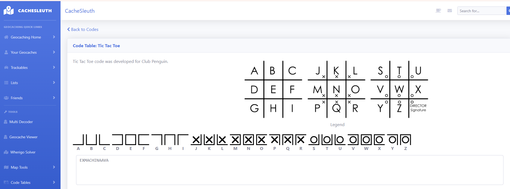

# Scanning-Week-6-7
This document provides a structured security assessment across network packet analysis, FTP traffic decoding, service enumeration, OS fingerprinting, and vulnerability scanning.

## 1. Question 1: Packet Analysis – ICMP & Encoding

**Objective**

Extract the hidden flag from packet1.pcap using packet capture analysis and Base64 decoding.

**Methodology**
* Inspect ICMP traffic in Wireshark.
* Confirm host reachability and TTL behavior.
* Extract the encoded payload, then decode it.

**Findings**
* ICMP echo requests and replies were successfully observed.
* TTL values confirmed the target host responded correctly.
* An encoded payload string was recovered from the packet.
   
**Result**

Encoded string: U1VCVEVYDYt2e2FpX21zX2Nvb30=

Decoded flag: SUCTF2023{ai_is_cool}

*WireShark ICMP Finding*

*Base64 decoded*

## 2. Question 2: FTP Traffic & Cipher Decoding

**Objective**

Analyze packet2.pcap to recover the final flag using FTP data extraction and multi-stage decoding.

**Methodology**

* Confirm host availability via ICMP.
* Capture FTP traffic and export relevant files.
* Expand shortened URLs or clues.
* Decode the identified cipher system.
* Perform final Base64 decoding.

**Decoding Process**

* Confirmed FTP host communication and extracted evidence.
* Expanded the TinyURL clue to reveal the hidden text.
* Decoded the Pigpen / Tic-Tac-Toe cipher.
* Applied Base64 decoding to obtain the final flag.

  
**Result**

* Pigpen output: EXMACHINAAVA
* Final flag: SUCTF2023{EXMACHINAAVA}

*WireShark FTP Finding*

*FTP Evindence*

*URL Evindence*

*PigPen Cipher Decode: Tic Tac Toe*

